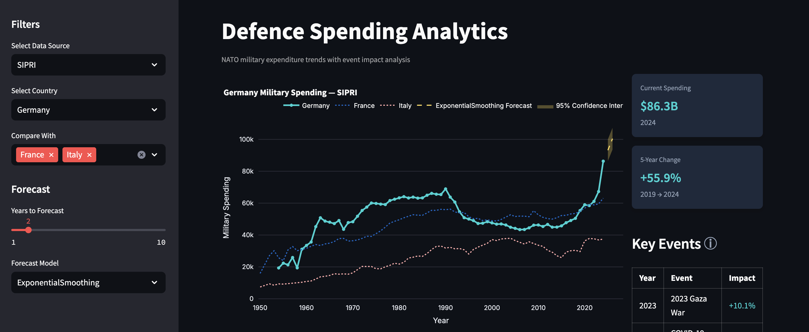
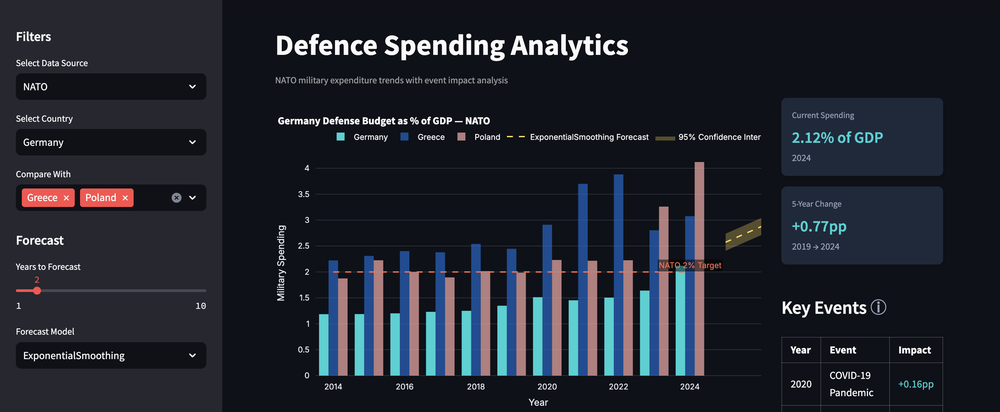

# NATO Defense Analytics Dashboard

An interactive Streamlit app that visualizes trends in NATO defense spending alongside major geopolitical events and their impacts on each member country’s defense budgets.

[Live Demo](https://geopolitical-dashboard-voss.streamlit.app/)

---

## Features

- Displays defense spending of NATO member countries in **million USD** and as a **percentage of GDP**.
- Visualizes spending trends over time with interactive charts.
- Highlights the impact of key geopolitical events (e.g., 9/11, Crimea annexation, Russia-Ukraine war) on defense budgets.
- Allows comparison between multiple countries.
- Shows NATO's 2% GDP spending target as a reference line.
- Provides detailed spending metrics and 5-year change percentages.

---

## Screenshots

 
 

---

## Installation

1. Clone the repo:

   ```bash
   git clone https://github.com/jacobvoss/geopolitical-dashboard.git
   cd geopolitical-dashboard
