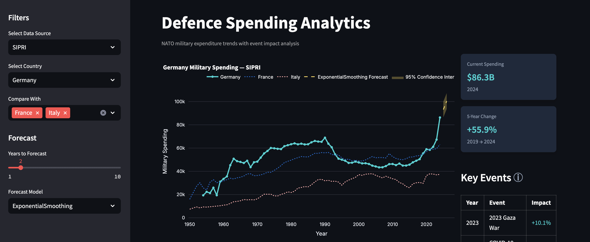
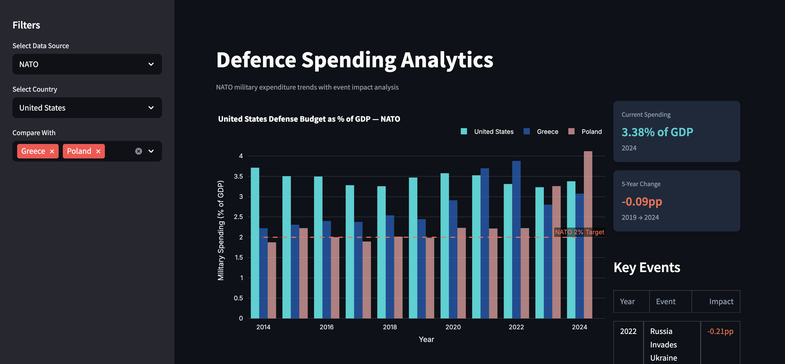

# NATO Defense Analytics Dashboard

An interactive Streamlit app that visualizes trends in NATO defense spending alongside major geopolitical events, their impacts on each member country’s defense budgets, and uses forecast models to predict future spending trends.

[Live Demo](https://nato-analysis-dashboard.streamlit.app/) 

---

## Features

- Displays defense spending of NATO member countries in **million USD** and as a **percentage of GDP**.
- Uses three different forecast models to predict future spending trends.
- Visualizes spending trends over time with interactive charts.
- Highlights the impact of key geopolitical events (e.g., 9/11, Crimea annexation, Russia-Ukraine war) on defense budgets.
- Allows comparison between multiple countries.
- Shows NATO's 2% GDP spending target as a reference line.
- Provides detailed spending metrics and 5-year change percentages.

---

## Screenshots

 
 

---

## Installation

1. Clone the repo:

   ```bash
   git clone https://github.com/jacobvoss/geopolitical-dashboard.git
   cd geopolitical-dashboard
2. Install dependencies:

   ```bash
   pip install -r requirements.txt
   ```

3. Run the app:

   ```bash
   streamlit run app.py
   ```

## Data Sources

This project relies on two publicly available datasets:

1. **SIPRI Military Expenditure Database** – data on defence spending from the
   [Stockholm International Peace Research Institute](https://www.sipri.org/databases/milex).
   SIPRI allows the data to be used for non‑commercial purposes provided that
   SIPRI is credited as the source. See the SIPRI website for full terms of use.

2. **NATO Defence Expenditure** – annual spending tables published by
   [NATO](https://www.nato.int/cps/en/natohq/topics_49198.htm). The Excel file
   `240617-def-exp-2024-TABLES-en.xlsx` was downloaded from NATO’s public site
   and is marked as **UNCLASSIFIED**. Attribution to NATO is required when using
   these figures.

The cleaned CSV files in `cleaned_data/` were produced from the above workbooks
using the Jupyter notebooks in this repository (`eda_notebook.ipynb` and
`eda_notebook_NATO.ipynb`). To refresh the data:

1. Download the latest workbooks from SIPRI and NATO and place them in the
   `data/` directory with the same filenames.
2. Open the notebooks and run all cells to regenerate the cleaned CSV files.
3. Commit the updated CSVs so the Streamlit app loads the new values.
